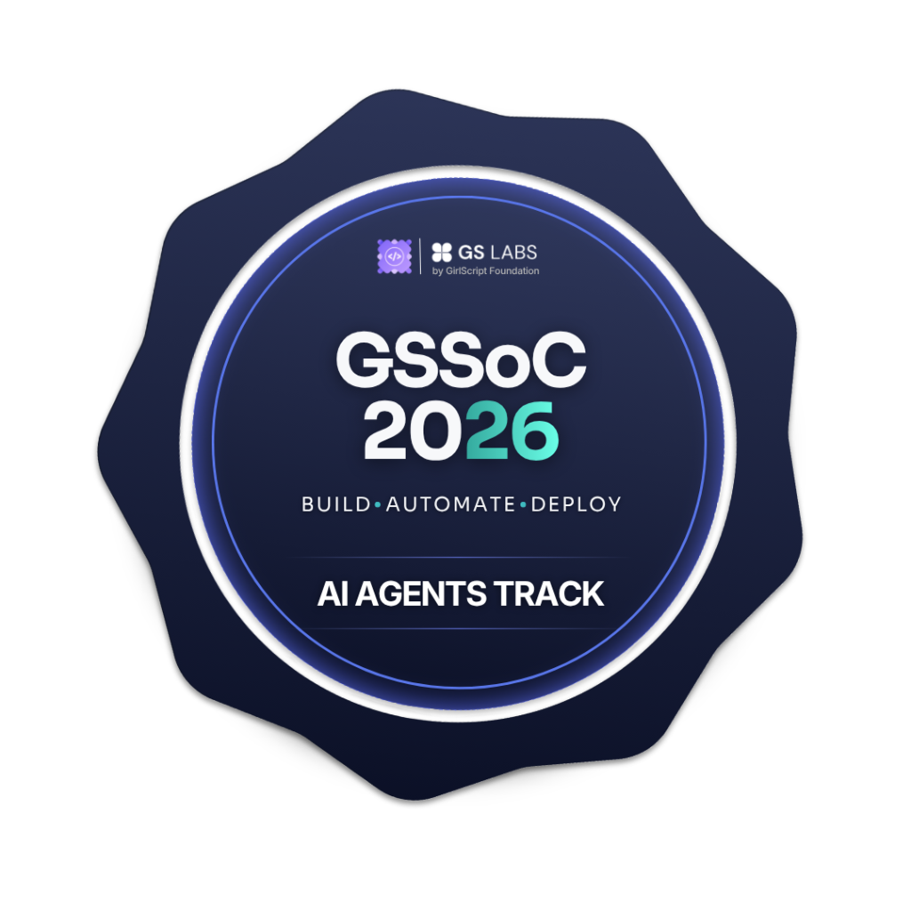
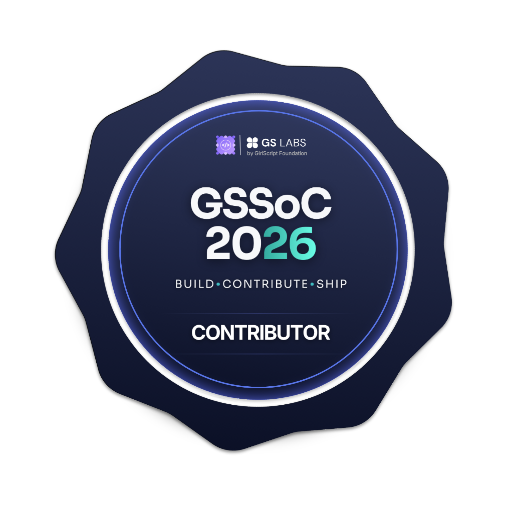
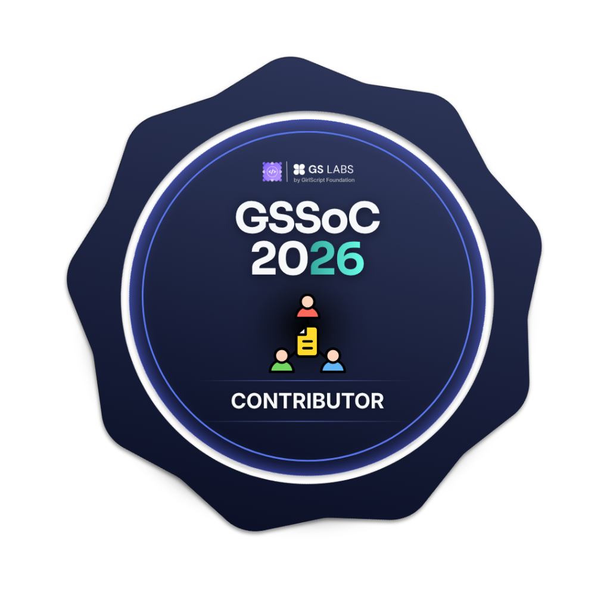
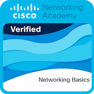
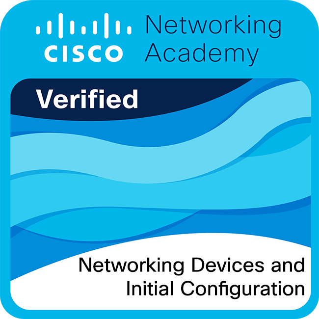

# ⚡ YASH RAJ SHARAN | 3D Interactive Lab & Portfolio

<div align="center">

```ascii
__   __     _     ____   _   _    ____      _         _ 
\ \ / /    / \   / ___| | | | |  |  _ \    / \       | |
 \ V /    / _ \  \___ \ | |_| |  | |_) |  / _ \   _  | |
  | |    / ___ \  ___) ||  _  |  |  _ <  / ___ \ | |_| |
  |_|   /_/   \_\|____/ |_| |_|  |_| \_\/_/   \_\ \___/ 

        
```

[](https://yashrajsharan.dev)
[](https://github.com/omen18)
[](LICENSE)

<br/>

**A bleeding-edge, high-performance 3D spatial portfolio and engineering lab converging Real-Time Computer Graphics, Rigid-Body Physics, Machine Learning Systems, Native Swift Apps, and Full-Stack Architectures.**

<br/>

[](https://react.dev)
[](https://www.typescriptlang.org)
[](https://threejs.org)
[](https://docs.pmnd.rs/react-three-fiber)
[](https://rapier.rs)
[](https://gsap.com)
[](https://swift.org)
[](https://pytorch.org)
[](https://vitejs.dev)

</div>

---

<p align="center">
  
</p>

---

## 🛰️ System Architecture & Interactive Modules

This portfolio operates as an interactive computing dashboard. Each module is engineered from scratch for tactile feedback, extreme optimization, and visual fidelity:

```
┌────────────────────────────────────────────────────────────────────────┐
│                        YASH RAJ SHARAN PORTFOLIO                       │
├───────────────────────────────────┬────────────────────────────────────┤
│  👤 3D Avatar Kernel              │  🎮 3D Rigid-Body Physics Wall     │
│  • Head Cursor Raycasting         │  • Rapier 3D WASM Engine           │
│  • Dynamic Specular Shaders       │  • Gravity Collisions & N8AO       │
├───────────────────────────────────┼────────────────────────────────────┤
│  💻 yash.exe CLI Terminal         │  📊 Live Contribution Matrix       │
│  • Simulated Kernel Boot          │  • 3,000+ GitHub Graph Commits     │
│  • Realtime Interactive Querying  │  • Open Source PR Stream           │
├───────────────────────────────────┼────────────────────────────────────┤
│  💼 Role Dispatcher Hub           │  🎧 Audio Engine & HUD             │
│  • Web Audio Procedural Sound     │  • Post Malone - Circles Stream    │
│  • Web3Forms Secure Gateway       │  • Synced Genius Lyrics Engine     │
└───────────────────────────────────┴────────────────────────────────────┘
```

### 🔹 1. Decrypted 3D Character Model (`src/components/Character/Scene.tsx`)
- Renders an optimized 3D avatar with real-time vector raycasting where the character's head and eyes smoothly track cursor position across viewport space.
- Configured with custom lighting rigs, ambient occlusion, and progressive decryption state loaders.

### 🔹 2. 3D Rigid-Body Physics Skill Matrix (`src/components/TechStack.tsx`)
- Powered by `@react-three/rapier` (WebAssembly-based physics).
- Tech capsules spawn with randomized restitution and mass, tumbling under simulated physical gravity, colliding with dynamic boundary colliders, and reacting to cursor drag impulses with `N8AO` screen-space ambient occlusion.

### 🔹 3. Sub-System CLI Console: `yash.exe` (`src/components/AskYash.tsx`)
- An interactive retro-futuristic terminal emulator replicating a raw Unix/DOS shell.
- Supports commands: `help`, `skills`, `projects`, `current_focus`, `why_ai`, `contact`, and `clear` with typing audio synthesis.

### 🔹 4. Live Open-Source Contribution Heatmap (`src/components/GithubHeatmap.tsx`)
- Custom-styled dark matrix displaying **3,000+ contributions**, **23+ public repositories**, and a **134-day streak**.
- Highlights merged upstream contributions to notable open-source ecosystems (e.g. **Refine**, **Helm**, **IBM**, and **GSSoC 2026**).

<div align="center">
  
  &nbsp;&nbsp;
  
  &nbsp;&nbsp;
  
  &nbsp;&nbsp;
  
  &nbsp;&nbsp;
  
</div>

### 🔹 5. Audio Synthesis & Genius Lyrics Sync (`src/components/Navbar.tsx`)
- Persistent floating spatial music HUD streaming *Circles* with synchronized real-time lyrics telemetry and audio spectrum animations.

### 🔹 6. Open To Work Dispatcher & Sound Engine (`src/components/OpenTo.tsx`)
- Interactive role switcher across **Internships**, **AI Research**, **Collaborations**, and **Open Source**.
- Integrated with custom **Web Audio API** procedural oscillators generating instant acoustic feedback on hover, select, and modal invocation.

---

## 🗂️ Engineering Builds Showcase

<div align="center">

| Project | Domain / Type | Core Stack | Repository / Demo |
|:---|:---|:---|:---|
| **🎫 Showpass** | Full-Stack Platform | React • Node.js • Express • MySQL | [](https://github.com/omen18/Ticket-Booking-System) [](https://show-pass-lemon.vercel.app/) |
| **🔬 CutisAI** | Clinical AI Vision | ResUNet • EfficientNet • ONNX • React | [](https://github.com/omen18/CutisAI.git) |
| **🖥️ MacDeck** | iOS/macOS Systems | Swift 5.9 • ScreenCaptureKit • CoreGraphics | [](https://github.com/omen18/MacDeck) |
| **🏝️ IslandPet** | iOS Dynamic Island | Swift • SwiftUI • ActivityKit • WidgetKit | [](https://github.com/omen18/IslandPet) |
| **📚 AI Study Companion** | GenAI / Agents | FastAPI • LangChain • OpenAI • React | [](https://github.com/omen18/ai-study-companion) |
| **🌾 AmritKrishi 2.0** | AgriTech Full-Stack | React • Node.js • PostgreSQL • Express | [](https://github.com/omen18/amritkrishi2.0/tree/master) |
| **🚚 AI Route Planner** | 3D Graph Optimization | Three.js • A*/Dijkstra • React | [](https://github.com/omen18/AI-delivery-route-planner) [](https://ai-delivery-route-planner.vercel.app/) |
| **🏃 CodeStride** | Developer Analytics | Next.js • GitHub OAuth • Contribution APIs | [](https://github.com/omen18/CodeStride.git) |
| **🎵 Musify** | Mobile Audio Streamer | Flutter • Dart • Material 3 • YouTube API | [](https://github.com/omen18/Musify.git) |

</div>

---

## 🛠️ Technology & Skill Matrix

```
[ FRONTEND & GRAPHICS ] ─── React 18 ── TypeScript ── Three.js ── R3F ── Rapier 3D ── GSAP ── Tailwind
[ AI & MACHINE LEARNING] ── PyTorch ── TensorFlow ── OpenCV ── LangChain ── ResUNet ── YOLOv8 ── MLOps
[ SYSTEMS & NATIVE APPS] ── Swift 5.9 ── SwiftUI ── ScreenCaptureKit ── Flutter ── Dart ── C++
[ BACKEND & DATABASES  ] ── Node.js ── FastAPI ── Express ── Next.js ── PostgreSQL ── MySQL ── MongoDB
[ CLOUD & DEVOPS       ] ── Docker ── AWS ── Git / GitHub Actions ── Vercel ── WebAssembly (WASM)
```

---

## ⚡ Quickstart & Local Setup

Deploy and test the laboratory locally on your workstation:

```bash
# 1. Clone repository
git clone https://github.com/omen18/Yash-Portfolio.git

# 2. Enter workspace
cd Yash-Portfolio

# 3. Install dependencies
npm install

# 4. Launch Vite development engine
npm run dev
```

Your server will spin up locally at `http://localhost:5173`.

---

## 📜 Motion Architecture & Licensing Protocols

### 🎬 Animation & GSAP Motion
- UI transitions and scroll velocity dynamics are driven by **GreenSock Animation Platform (GSAP)** and `@gsap/react`.
- *Note:* If utilizing GSAP Club plugins (such as `gsap-trial`), remember that trial builds are strictly designated for local evaluation and research. For official production deployments requiring Club plugins, reference the [GSAP Installation Documentation](https://gsap.com/docs/v3/Installation/).

### 🔒 Intellectual Property & Fair Use
> [!IMPORTANT]
> The source code in this repository represents custom design, visual assets, 3D layouts, and engineering logic.
> - Feel free to inspect, learn, and draw inspiration for your own projects.
> - Direct full cloning, uncredited mirroring, or commercial redistribution without prior written consent is prohibited.

---

<div align="center">

```
  ┌────────────────────────────────────────────────────────┐
  │  Designed & Engineered by YASH RAJ SHARAN © 2026       │
  │  Full-Stack Developer • AI Engineer • Software Dev     │
  └────────────────────────────────────────────────────────┘
```

[](https://linkedin.com/in/yashrajsharan)
[](mailto:yashraj10messi@gmail.com)
[](https://github.com/omen18)

</div>
